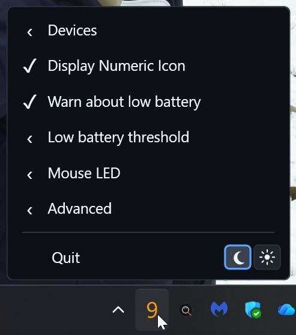
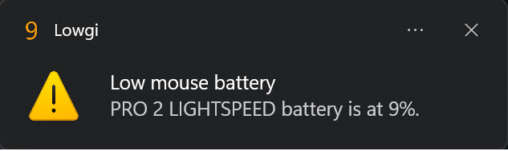

<a id="readme-top"></a>

[![.NET 10][dotnet-shield]][dotnet-url]
[![Windows][windows-shield]][windows-url]
[![Issues][issues-shield]][issues-url]
[![GPL-3.0 License][license-shield]][license-url]

<br />
<div align="center">
  <h1 align="center">Lowgi</h1>

  <p align="center">
    A small Windows tray app that shows the battery level of Logitech wireless devices.
    <br />
    <a href="https://github.com/BagerRyg/Lowgi/issues/new"><strong>Report a bug</strong></a>
  </p>
</div>

## About The Project

Lowgi is a lightweight Windows tray utility for Logitech Lightspeed and wireless devices. It keeps an eye on your device battery, shows the current level in the notification area, warns you when the battery is low, and can control supported mouse LEDs based on battery and charging state.

The app can show either a numeric battery percentage tray icon or a small device/battery-style tray icon. The tray menu lets you pick devices, warning thresholds, update intervals, LED behavior, autostart, debug logging, and dark or light theme.

This project is a fork of [andyvorld/LGSTrayBattery](https://github.com/andyvorld/LGSTrayBattery) by `andyvorld`.

> Note: I have only been able to validate and test Lowgi with a single Logitech Lightspeed device. It should technically work with other Lightspeed/wireless enabled Logitech devices, but I would really like feedback from anyone testing it with a different device.

<p align="right">(<a href="#readme-top">back to top</a>)</p>

## Built With

* [![.NET 10][dotnet-shield]][dotnet-url]
* WPF
* Native Logitech HID++ communication

<p align="right">(<a href="#readme-top">back to top</a>)</p>

## Features

* Numeric tray icon showing the current battery percentage.
* Alternate tray icon with a tiny battery indicator.
* Selectable low-battery warning thresholds.
* Windows low-battery notifications.
* Selectable update intervals.
* Multiple mouse LED modes.
* Automatic LED updates when battery or charging state changes.
* Autostart with Windows through the current-user `HKCU` Run registry key.
* Dark and light tray UI.
* Defaults to the current Windows app theme on first start.
* Single-instance protection so only one Lowgi process should run at once.

<p align="right">(<a href="#readme-top">back to top</a>)</p>

## Screenshots

### Tray Menu



### Low Battery Notification



<p align="right">(<a href="#readme-top">back to top</a>)</p>

## How It Works

Lowgi talks to Logitech devices through native HID++ messages. It discovers compatible devices, reads their battery percentage and power state, then updates the tray icon, warning logic, and LED state from that data.

The app does not need a local web server. It runs in the tray, polls at the selected update interval, and applies updates only when the relevant battery, charging, device, or setting state changes.

Autostart uses:

```text
HKCU\Software\Microsoft\Windows\CurrentVersion\Run
```

That means the startup entry is per-user and does not require administrator rights.

<p align="right">(<a href="#readme-top">back to top</a>)</p>

## LED Modes

Lowgi supports several LED modes for devices that expose compatible Logitech LED controls:

* **Dynamic**: The default mode. Green at 100% battery while plugged in, orange while plugged in and charging below 100%, red at 50% brightness below the selected warning threshold, and dim white while idle.
* **Bright White**: Keeps the LED white at full brightness.
* **Dim White**: Keeps the LED white at reduced brightness.
* **Low Battery**: Keeps the LED dim white normally, then changes it to red when the battery is at or below the selected warning threshold.
* **Always Off**: Turns the LED off.

Behind the scenes, Lowgi reads the latest battery percentage and charging status, maps that state to the selected LED mode, then sends the matching static RGB value to the device LED zones that support it.

<p align="right">(<a href="#readme-top">back to top</a>)</p>

## Usage

Start `Lowgi.exe` and use the tray icon menu to configure it.

Common options:

* Choose whether the tray icon is numeric or battery-style.
* Pick the low-battery warning threshold.
* Choose the battery update interval.
* Select the mouse LED mode.
* Enable or disable Windows autostart.
* Switch between dark and light mode.

<p align="right">(<a href="#readme-top">back to top</a>)</p>

## Bugs

Please report bugs directly on GitHub:

[https://github.com/BagerRyg/Lowgi/issues](https://github.com/BagerRyg/Lowgi/issues)

If you are using a Logitech device that is not the one I have tested with, please include the exact model name and what works or does not work.

<p align="right">(<a href="#readme-top">back to top</a>)</p>

## License

Distributed under the GPL-3.0 license. See [LICENSE](LICENSE) for more information.

<p align="right">(<a href="#readme-top">back to top</a>)</p>

## Acknowledgments

* Forked from [andyvorld/LGSTrayBattery](https://github.com/andyvorld/LGSTrayBattery).
* Built for [RygTech](https://rygtech.org).

<p align="right">(<a href="#readme-top">back to top</a>)</p>

[dotnet-shield]: https://img.shields.io/badge/.NET-10-512BD4?style=for-the-badge&logo=dotnet&logoColor=white
[dotnet-url]: https://dotnet.microsoft.com/
[windows-shield]: https://img.shields.io/badge/Windows-Tray%20App-0078D4?style=for-the-badge&logo=windows&logoColor=white
[windows-url]: https://www.microsoft.com/windows
[issues-shield]: https://img.shields.io/github/issues/BagerRyg/Lowgi.svg?style=for-the-badge
[issues-url]: https://github.com/BagerRyg/Lowgi/issues
[license-shield]: https://img.shields.io/badge/License-GPL--3.0-blue.svg?style=for-the-badge
[license-url]: LICENSE
